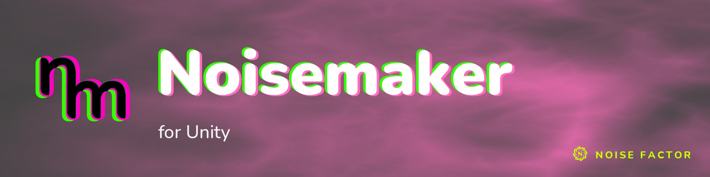

<!-- repo-hero -->
<a href="https://noisemaker.app/"></a>

<sub>Open source from <a href="https://noisefactor.io">Noise Factor</a> &middot; <a href="https://github.com/noisefactorllc">more projects</a></sub>

# Noisemaker for Unity

Current measured support: [compatibility report](docs/COMPATIBILITY.md).

Current qualification limits: [completion gaps](docs/COMPLETION_GAPS.md).

> This package supports the "Export Shader Pipeline" feature in Noisedeck.app. The
> feature runs shader compositions on other platforms. Noise Factor derives this package
> from the upstream Noisemaker Engine project and tests it for pixel-level parity.

A parallel port of the Noisemaker shader engine — a separate reference engine, not bundled
with this package — to **Unity / HLSL**.
It renders **live procedural textures from the Polymorphic DSL**, aiming to be
**pixel-identical** to the JS/WebGPU reference engine, and exposes effects both as a
standalone renderer and as **Shader Graph (material) nodes**.

> **🚧 WIP — stabilization toward a full-parity release.** All 210 declared effects are
> structurally graph-verified against the pinned reference authority (`noisemaker@c9ee8a04`),
> and the declared fixture corpora (144 programs across root/3D/classic/synth/v104/tiled gates) render
> with zero failures — 127 strict byte-level passes plus 17 measured, bounded exceptions.
> The installed Quick Start workflow and macOS player builds are qualified end-to-end on Unity 6.
> Still open: Windows/Linux coverage, the live-display color pipeline, and remaining per-effect
> parameter/state sweeps (Unity 6 is required; older versions are not supported). Treat
> remaining platform claims as provisional until those close.

## Layout

```
noisemaker-for-unity/
├─ README.md                 ← you are here
├─ ARCHITECTURE.md           ← system design; how each reference subsystem maps to C#/HLSL
├─ PORTING-GUIDE.md          ← the GLSL/WGSL → HLSL rulebook (read before porting a shader)
├─ docs/GRAPH-JSON-SCHEMA.md ← the Render Graph JSON contract (exporter ↔ C# runtime)
├─ reference/                ← precise re-implementer specs of every reference subsystem (01–10)
├─ unity/com.noisemaker.hlsl/← the Unity package (UPM, drop-in)
│  ├─ Runtime/   ← RenderGraph executor (CommandBuffer Blit pipeline; pipeline-agnostic)
│  ├─ Compiler/  ← C# DSL frontend (lex→parse→validate→expand) + shared graph model
│  ├─ Shaders/   ← NMCore/NMFullscreen includes + per-effect HLSL ports + NMBlit
│  ├─ ShaderGraph/← per-effect Custom Function node wrappers
│  ├─ Effects/   ← effect definition JSON consumed by the runtime
│  └─ Editor/    ← parity runner + tooling
├─ tools/                    ← Node: export-graph (golden), convert-definitions (regenerate Effects/*.json)
└─ parity/                   ← golden-image harness + comparison + test programs
```

## The core idea: a shared Render Graph

The reference compiles DSL into a **Render Graph** (`passes / programs / textures /
renderSurface`). That is the seam. Noisemaker for Unity produces the same graph two ways:

- **Golden / offline** — `tools/export-graph.mjs` runs the *unchanged reference*
  `compileGraph` and serialises the graph to JSON (zero graph-construction parity risk).
  Producing your own `graph.json` this way (and regenerating effect JSON with
  `tools/convert-definitions.mjs`) requires a checkout of the separate Noisemaker reference
  engine. Point `NM_REFERENCE_ROOT` at its root. The reference engine is **not** included in this package.
  To render immediately with no external dependency, import the bundled **Quick Start** sample.
  It ships a ready `graph.json` — see *Quick start* below.
- **Live / in-Unity** — the C# `Compiler/` port compiles DSL at runtime. The recorded
  v1.0.104 comparison matched 304/304 programs against the golden path via `tools/graphdump`,
  including the `--selftest` corpus. This is structural graph parity, with per-instance metadata
  excluded. It does not verify rendered pixels or every runtime/platform combination. See
  `parity/README.md` § Graph parity for the corpus and comparison rules.

Both feed the same `NMPipeline` executor + HLSL shaders. When their graphs match, visual parity
depends on the shaders and the executor — see [ARCHITECTURE.md](ARCHITECTURE.md).

## Quick start (once opened in Unity)

> Requires **Linear color space** (*Player ▸ Color Space*) and, for player builds, the
> `Noisemaker/*` shaders added to *Graphics ▸ Always Included Shaders*. See the package
> README (`unity/com.noisemaker.hlsl/README.md`) for the full, authoritative integration
> and build guide — the defaults will not "just work" in a build.

1. Add the package: *Package Manager → Add package from disk →*
   `noisemaker-for-unity/unity/com.noisemaker.hlsl/package.json`.
2. **Fastest first render (no reference-engine or Node dependency):** in *Package Manager →
   Noisemaker for Unity → Samples* tab, **Import "Quick Start"**. Then follow the sample's README:
   set *Color Space = Linear*. Create a *Quad* with an *Unlit/Texture* material.
   Add the `NMQuickStartExample` component. Assign **Graph Json** = `NoiseGraph.json`.
   Assign **Target** = the Quad's `Renderer`. Press **Play**. This renders the bundled
   `noise → blur` graph.
3. **Your own content:** add an `NMRenderer` component and assign a source — a `GraphJson`
   TextAsset (recommended/verified; produce one with `tools/export-graph.mjs`, which needs the
   separate reference engine — see *The core idea* above) **or** a `Dsl` string plus the
   `EffectDefinitions` TextAssets (live compiler; graph-parity-tested as described above). Then call `Rebuild()`.
4. Read `NMRenderer.Output` (an `ARGBHalf` `RenderTexture`, valid after the first frame)
   into any material, or drop a Noisemaker **Custom Function node** into a Shader Graph.

## Status

**Compiles and renders in Unity 6** (verified on 6000.3.16f1). The C# engine compiles
clean (compiler contract tests: PASS) and all effect shaders compile via batchmode
package import + render passes. Parity-critical shaders (PCG, noise, cell,
blend, blur) were additionally hardened by adversarial line-by-line review vs the WGSL.

**Pixel parity verified** via the `parity/` harness (JS/WebGL2 golden in headless Chromium
↔ Unity candidate ↔ `batch-compare.py`), regenerated at pinned reference authority
`noisemaker@c9ee8a04` (v1.0.176). Current measured state: **graph parity 316/316
byte-clean** (the full 207-program `--selftest` corpus + all 109 fixture programs, C#
live-DSL compiler vs the reference oracle) and **144/144 rendered fixtures graded with
zero failures** — 127 strict `PASS` and 17 narrowly bounded `ALLOWED_NEAR` (root corpus 5,
3D corpus 3, classicNoisedeck corpus 2, synth corpus 3, v104 corpus 4), every one pinned by max delta,
SSIM floor, exceeded pixel/channel counts, and exact pixel coordinates in the tracked exception files.
Both the `classicNoisedeck` (20/20) and renderable `synth` (26/26) namespaces are 100% pixel-parity
qualified. The 3-case tiled large-format gate is exact at zero tolerance. Per-corpus tolerances stay
separate (root/3D/classic/synth/v104 each have their own policy); see `docs/COMPATIBILITY.md` §3 and
`parity/README.md` for the gates.

The Y-flip reconciliation the design anticipated is now solved properly: Unity flips Y once
per `DrawProcedural` into a RenderTexture, so textures of odd-vs-even render depth ended up
oppositely oriented (only exposed when a mixer samples two such inputs — `blendMode`).
`NMVertFullscreen` counter-flips clip-space Y by `_ProjectionParams.x`, making every pass
store one consistent orientation regardless of depth. sRGB/linear and FMA are confirmed
correct by the SSIM-1.0 matches.

Bringing up Unity + the parity harness surfaced (and fixed) real bugs static review missed:
C# variable shadowing, a `PassType` namespace clash, an `NMBlit` include path + `src` input
name, batchmode `Shader.Find` resolution, multi-pass `Material.FindPass` selection, ShaderLab
reserved-word collisions in the (now-removed, MPB-driven) `Properties` blocks, the HLSL
reserved word `point` in `Cell.hlsl`, and `export-graph` starter-op + compile-time-`define`
promotion. See `parity/README.md` for the runbook.

**Effect coverage: 210 effect definitions** — every namespace complete:
`synth` 29 · `filter` 113 · `mixer` 15 · `classicNoisedeck` 20 · `points` 11 · `synth3d` 8 ·
`filter3d` 2 · `render` 12 (the `render` count includes the `loopBegin`/`loopEnd`/`meshLoader`
control passes). 209 ship a renderable shader; `synth/media` is a definition-only stub (no
shader — external image/video input is out of scope). `Shaders/` additionally carries the
`NMBlit`, `NMFrameExportResolve`, and `NMCubeEquirect` utility shaders. The served kit
(`0.1.17`) publishes the identical source revision and all 2107 files verify against its
inventory.

Each ported effect ships an `.hlsl` core, a `.shader`, and a runtime `Effects/*.json`.
Single-pass effects also ship a Shader Graph Custom Function node. Every port is faithful to
the reference **WGSL**. PRNG-heavy, multi-pass, agent, and 3D ports were additionally
hardened by adversarial line-by-line review against the WGSL.

The runtime was hardened in stages to execute the harder patterns: **feedback/state**
(persistent surfaces, `repeat:` ping-pong, MRT), **agents** (`DrawProcedural(Points)`
scatter + additive deposit + `rgba32f` state), and **3D/mesh** (64×4096 volume atlas +
raymarch, OBJ loader + mesh-data textures, loop expansion). The C# DSL frontend handles
multi-statement programs, `read(oN)` / mid-chain `.write()`, `let` bindings, multi-input
(mixer) chains, `loopBegin`/`loopEnd`, and the 3D lane (`read3d`/`write3d`/`textures3d`,
graph-verified against the reference); `subchain` and `if`/`elif` remain staged.

`tools/convert-definitions.mjs` regenerates all effect-definition JSONs automatically.
The per-effect port path is documented in [PORTING-GUIDE.md](PORTING-GUIDE.md).

## Contributing

Issues and pull requests are welcome. Please review the [Code of Conduct](CODE_OF_CONDUCT.md) before opening changes.

## License

Noisemaker for Unity is released under the [MIT License](LICENSE). Use of the Noisemaker and Noise Factor names in derivative products is subject to the [Trademark Policy](TRADEMARK.md).

Copyright © 2026 Noise Factor LLC
