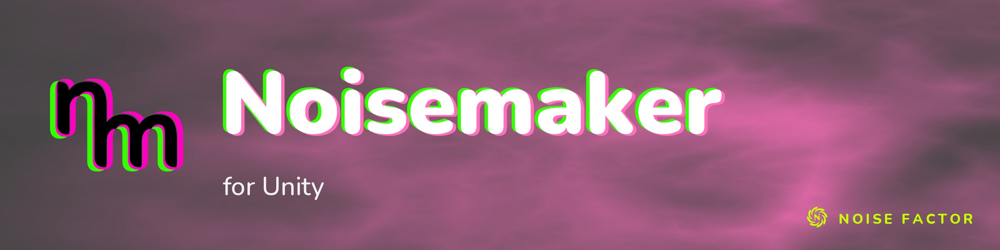

<!-- repo-hero -->
<a href="https://noisemaker.app/"></a>

<sub>Open source from <a href="https://noisefactor.io">Noise Factor</a> &middot; <a href="https://github.com/noisefactorllc">more projects</a></sub>

# Noisemaker for Unity

> This package supports the "Export Shader Pipeline" feature in Noisedeck.app. The
> feature runs shader compositions on other platforms. Noise Factor derives this package
> from the upstream Noisemaker Engine project and tests it for pixel-level parity.

A parallel port of the Noisemaker shader engine — a separate reference engine, not bundled
with this package — to **Unity / HLSL**.
It renders **live procedural textures from the Polymorphic DSL**, aiming to be
**pixel-identical** to the reference engine's WebGL2 output, and exposes effects both as a
standalone renderer and as **Shader Graph (material) nodes**. Unity 6 (`6000.0+`) is
required.

## Layout

```
noisemaker-for-unity/
├─ README.md                 ← you are here
├─ ARCHITECTURE.md           ← system design; how each reference subsystem maps to C#/HLSL
├─ PORTING-GUIDE.md          ← the GLSL/WGSL → HLSL rulebook (read before porting a shader)
├─ docs/GRAPH-JSON-SCHEMA.md ← the Render Graph JSON contract (exporter ↔ C# runtime)
├─ reference/                ← precise re-implementer specs of every reference subsystem (01–10)
├─ unity/com.noisemaker.hlsl/← the Unity package (UPM, drop-in)
│  ├─ Runtime/   ← RenderGraph executor (CommandBuffer Blit pipeline; pipeline-agnostic)
│  ├─ Compiler/  ← C# DSL frontend (lex→parse→validate→expand) + shared graph model
│  ├─ Shaders/   ← NMCore/NMFullscreen includes + per-effect HLSL ports + NMBlit
│  ├─ ShaderGraph/← per-effect Custom Function node wrappers
│  ├─ Effects/   ← effect definition JSON consumed by the runtime
│  └─ Editor/    ← parity runner + tooling
├─ tools/                    ← Node: export-graph (golden), convert-definitions (regenerate Effects/*.json)
└─ parity/                   ← golden-image harness + comparison + test programs
```

## The core idea: a shared Render Graph

The reference compiles DSL into a **Render Graph** (`passes / programs / textures /
renderSurface`). That is the seam. Noisemaker for Unity produces the same graph two ways:

- **Golden / offline** — `tools/export-graph.mjs` runs the *unchanged reference*
  `compileGraph` and serialises the graph to JSON (zero graph-construction parity risk).
  Producing your own `graph.json` this way (and regenerating effect JSON with
  `tools/convert-definitions.mjs`) requires a checkout of the separate Noisemaker reference
  engine. Point `NM_REFERENCE_ROOT` at its root. The reference engine is **not** included in this package.
  To render immediately with no external dependency, import the bundled **Quick Start** sample.
  It ships a ready `graph.json` — see *Quick start* below.
- **Live / in-Unity** — the C# `Compiler/` port compiles DSL at runtime. `scripts/test`
  compares its graphs with the reference compiler's for the `--selftest` corpus, every
  fixture program, and the parameter sweep. This is structural graph parity, with per-instance
  metadata excluded; it does not verify rendered pixels. See `parity/README.md` § Graph
  parity for the corpus and comparison rules.

Both feed the same `NMPipeline` executor + HLSL shaders. When their graphs match, visual parity
depends on the shaders and the executor — see [ARCHITECTURE.md](ARCHITECTURE.md).

## Quick start (once opened in Unity)

> Requires **Linear color space** (*Player ▸ Color Space*) and, for player builds, the
> `Noisemaker/*` shaders added to *Graphics ▸ Always Included Shaders*. See the package
> README (`unity/com.noisemaker.hlsl/README.md`) for the full, authoritative integration
> and build guide — the defaults will not "just work" in a build.

1. Add the package: *Package Manager → Add package from disk →*
   `noisemaker-for-unity/unity/com.noisemaker.hlsl/package.json`.
2. **Fastest first render (no reference-engine or Node dependency):** in *Package Manager →
   Noisemaker for Unity → Samples* tab, **Import "Quick Start"**. Then follow the sample's README:
   set *Color Space = Linear*. Create a *Quad* with an *Unlit/Texture* material.
   Add the `NMQuickStartExample` component. Assign **Graph Json** = `NoiseGraph.json`.
   Assign **Target** = the Quad's `Renderer`. Press **Play**. This renders the bundled
   `noise → blur` graph.
3. **Your own content:** add an `NMRenderer` component and assign a source — a `GraphJson`
   TextAsset (recommended/verified; produce one with `tools/export-graph.mjs`, which needs the
   separate reference engine — see *The core idea* above) **or** a `Dsl` string plus the
   `EffectDefinitions` TextAssets (live compiler; graph-parity-tested as described above). Then call `Rebuild()`.
4. Read `NMRenderer.Output` (an `ARGBHalf` `RenderTexture`, valid after the first frame)
   into any material, or drop a Noisemaker **Custom Function node** into a Shader Graph.

## Coverage

All 210 reference effect definitions ship as runtime `Effects/*.json`, regenerated from the
reference by `tools/convert-definitions.mjs`. 209 ship a shader: `synth/media` is a
definition-only stub, since external image and video input is out of scope. Each ported effect
has an `.hlsl` core and a `.shader`; single-pass effects also ship a Shader Graph Custom
Function node. `Shaders/` also carries the `NMBlit`, `NMFrameExportResolve`, and
`NMCubeEquirect` utility shaders.

The runtime executes feedback and persistent state (`repeat:` ping-pong, MRT), agents
(`DrawProcedural(Points)` scatter with additive deposit and `rgba32f` state), and the 3D lane
(64×4096 volume atlas with raymarching, the OBJ loader and mesh-data textures, loop expansion).
The C# DSL frontend handles multi-statement programs, `read(oN)` and mid-chain `.write()`,
`let` bindings, mixer chains, `loopBegin`/`loopEnd`, and `read3d`/`write3d`/`textures3d`;
`subchain` and `if`/`elif` are not supported yet.

## Verification

The reference authority is pinned by commit in `scripts/test` (`REFERENCE_SHA`); every gate
runs against that revision.

- `scripts/test` needs neither Unity nor a GPU. It runs the Node and Python unit tests, the
  C# compiler contract tests, and graph parity between the C# compiler and the reference
  compiler for 316 programs plus the 1900-variant parameter sweep. CI runs it on every push
  without the sweep, and in full weekly and on manual dispatch.
- The pixel gates in `parity/` render each corpus with the reference (headless Chromium,
  WebGL2) and with Unity from the same program, then grade fail-closed with
  `parity/batch-compare.py`: the root, 3D, classicNoisedeck, synth, mixer, points, filter, and
  render corpora, the v1.0.104 corpus and its tiled gate, and the 1900-variant parameter
  sweep. Together they cover the 207 effects that render without audio input;
  `synth/scope` and `synth/spectrum` need audio and are graph-checked only. They need a
  licensed Unity editor and a GPU, so they run on a host, not in CI.
- A case outside the corpus tolerance passes only through an exception file that names the
  case and pins its measured bounds and pixels. The per-corpus tolerances and exception files
  are listed in `parity/README.md`.

Verified on Unity `6000.3.16f1` on macOS (Apple silicon, Metal) with the Built-in render
pipeline. Windows and Linux editors are not verified.

## Contributing

Contributions follow the Noise Factor [contributing policy](https://github.com/noisefactorllc/.github/blob/main/CONTRIBUTING.md) and [Code of Conduct](https://github.com/noisefactorllc/.github/blob/main/CODE_OF_CONDUCT.md).

## License

Noisemaker for Unity is released under the [MIT License](LICENSE). Use of the Noisemaker and Noise Factor names in derivative products is subject to the [Trademark Policy](TRADEMARK.md).

Copyright © 2026 Noise Factor LLC
